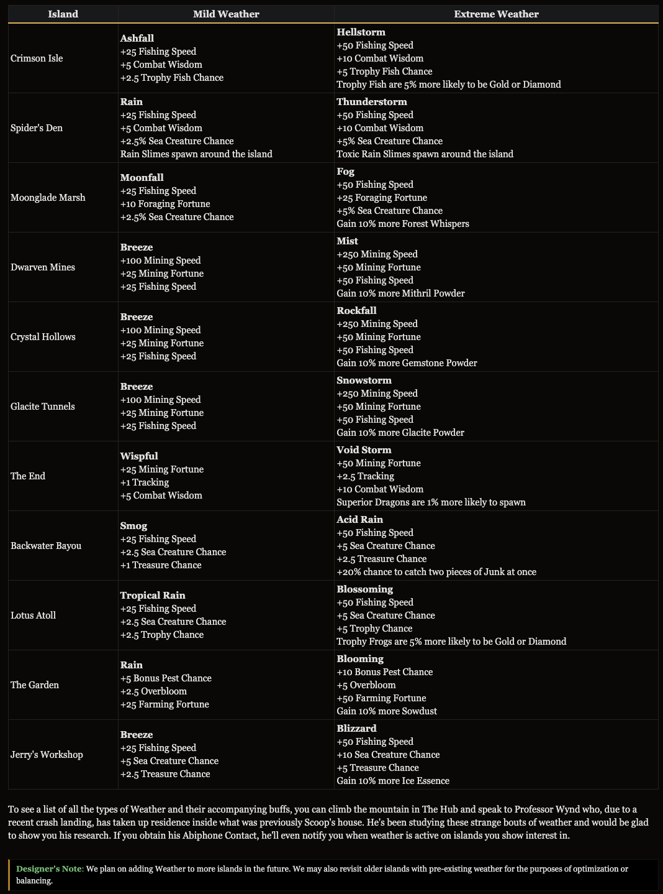

## 0.27.2 - The Minister Update, Greenhouse QOL, and More!

### The Minister Update

> During Mayor Aura's term, all players were able to campaign to be elected as a "Minister", to either help with or interfere with Aura's schemes. At the core of each player's election campaign was the promise that they would get a particular perk added to the game - be that a new accessory line, pet, and so on. Today, we bring you the complete set of "Minister Perks", all of which were individually designed in correspondence with each of the elected Ministers.

#### Precursor Drone (thirtyvirus)
The Precursor Drone has received some changes! Now being base Legendary, players may collect pet items known as "Drone Mods" from various areas of the game and attach them to the Precursor Drone in order to grant it new base stats and perks. There are currently 3 Drone Mods but, who knows, maybe more will be added in the future:
- Drone Mod: Grungle → Forest Essence Shop, 2,500x Forest Essence
- Drone Mod: Contraband → Crafted using various Junk items sourced from the Backwater Bayou
- Drone Mod: Mining off Camera → Diamond Essence Shop, 2,500x Diamond Essence
_ahh I don't care abt this that much I think_

#### Blood God Sigil & Potato Ring (Technodad)
Technodad's perk started a Year of the Pig event while he was in office - along with buffs to Potato Minions, and introduced two new upgrades to the Potato Talisman and Blood God Talisman. Players can craft both these upgrades - which have been gracefully bestowed upon SkyBlock by the Great Potato King himself - from items gathered from Shiny Pigs.
_I have already had them, isn't it?_

#### Mining Fiesta Rework (zj2)
_alr this dude again_

When Mayor Cole is elected with his Mining Fiesta perk, said Fiesta will now span his entire mayorship! Though the buffs have been toned down a bit as a result, you can purchase up to 5 Fiesta Flasks (as well as a brand-new Attribute) from Brynmor that stack additively with the base fortune buff from the fiesta, allowing you to either consume them when you're sure you have the time in order to maximize your profits, or store them up to go all-out during a future Fiesta.

#### Hotspot Talisman, Ring, and Artifact (Derailious)
_It seems like this one is kind of useful?_

Located in the Clay Collection (Clay being the token drop of Water Hotspot Sea Creatures), the Hotspot Talisman line grants you even more useful buffs when fishing in a Hotspot, and is crafted out of materials gathered from various Hotspot Sea Creatures and junk found in the Bayou.

#### Beastslayer's Codex (Intrests)
_wait this one is so good I like this_

The Beastslayer's Codex is a talisman given by Bramass Beastslayer upon reaching Bestiary Milestone 50. Though it starts out as a mere common accessory, the Codex upgrades as you progress through the Bestiary Milestones:
- Milestone 300:
  - Increases to MYTHIC
  - Stats:
    - Strength: +6
    - Intelligence: +5
    - Crit Damage: +4
    - Ability Damage: +3
    - Tracking: +2
    - Magic Find: +1

#### Eagle Pet (Kuvdra)
_good but doesn't matter to me, sad_

This Minister sought to add the Eagle Pet - a Hunting Pet exclusive to the Critter Safari. Unlocked and upgraded through the Safari Essence Shop, the Eagle Pet will accompany you whenever you enter the Safari, and has a whole host of perks to offer that'll help you out.

#### Small, Medium, and Large Bait Sack (CandyPat)
_hmmmmm you really should just replace the fishing bag as this, really this is better_

The Fishing Bag has been converted into the Bait Sack! Unlocked through the Raw Cod collection, the Small Bait Sack can be upgraded all the way to the Large Bait Sack, which can hold 20,160 of each Fishing Bait found throughout the game.

The new Bait Sack line serves as a more intuitive and organized version of what was previously the Fishing Bag. It even allows you to favor a particular bait by shift-clicking it, which ensures that bait will be always be used so long as you have some of it in your sacks.

#### Powder of the People (Alaawii)
_good! I don't have spare glossy minerals for powder coating tho_

The Powder of the People accessory line has been to the game! It can be obtained and upgraded through the Dwarven Forge.
- Powder of One: Increases Mithril Powder gain by +2.5%
  - HOTM Requirement: 2
  - Material Requirement: 1x Refined Mithril, 1x Refined Titanium
  - Forging Process: 1 Hour
- Powder of The Few: Increases Mithril Powder and Gemstone Powder gain by +5%
  - HOTM Requirement: 5 
  - Material Requirement: 1x Powder of One, 4x Gemstone Mixture, 32x Refined Mineral 
  - Forging Process: 1 Hour
- Powder of The Many: Increases Mithril Powder, Gemstone Powder, and Glacite Powder gain by +7.5%
  - HOTM Requirement: 8 
  - Material Requirement: 1x Powder of the Few, 4x Glacite Amalgamation, 32x Glossy Gemstone 
  - Forging Process: 6 Hours
- Powder of the People: Increases Mithril Powder, Gemstone Powder, and Glacite Powder gain by +10% 
  - Obtained via combining Powder of the People with Divan's Powder Coating in an Anvil

#### Scatha-in-a-Bottle (Toadstar0)
Craft yourself a Nothing-in-a-bottle upon reaching Living Metal Heart 3! What does it do, you may ask? Nothing! However, if you take the bottle out of the Rift and into the overworld, you may feel a strange compulsion to use it to capture a Scatha. Upon doing so, you'll find yourself with a brand-new Mixin that grants a whopping +20 Tracking towards Scatha!

In addition to this new item, Worm Membranes have also been added to some Drop Tables:
- Stoneworm: 1x Worm Membrane (100%)
- Scatha: 4x Worm Membrane (100%)

#### Returning Player Buffs (Endthr)
_am I playing a mihoyo game lol_

Returning players who have been offline from SkyBlock for 90 days or more will find Calvin waiting for them when they return to their Private Island. A thoughtful soul, Calvin will give returning players some handy buffs to boost their progression a little upon their return:
- A flat amount of Coins
  - +500,000-2,500,000
- Bonus Skill Wisdom
  - +5-25
- Slayer XP Boost
  - +5-25%
- Dungeons XP & Dungeons Class XP Boost
  - +5-25%
Calvin's buffs last for 7 days, so make the most of them while you have them!

#### Secret Bingo #2 (arithemonkey)
_tbh I don't get it..._

This Minister desired a second Secret Bingo event, which we decided to release in April 2026 to coincide with April Fools. We were very happy with how it went - goals were discovered at a good pace, participation was high, and it seemed like players were having an all-round good time. You can expect another Secret Bingo in the future, though we don't have a concrete timeline for it just yet.

#### Dark Auction Improvements (lejimbo)
_wait let me check it first, omg it's true_

It has been made easier to obtain the Seal of the Family accessory line:
- Reduced Dark Auction purchases required to obtain the Shady Ring from 5 → 1
- Reduced Dark Auction purchases required to obtain the Crooked Artifact from 10 → 3
- Reduced Dark Auction purchases required to obtain the Seal of the Family from 15 → 7
The following changes have also been made to the Dark Auction pool:
- Added Prosecute VI
- Added Execute VI
- Removed Sharpness VI
- Removed Protection VI

#### Island Weather (ALAND_)
Weather has been added to several islands throughout SkyBlock! Mild weather occurs every 20 minutes, and grants thematic stats to all players on the island. Every 3rd instance of weather will instead of EXTREME, granting more stats alongside an exclusive bonus:

#### Related Changes
_I've read therefore don't have to write down_

### Greenhouse QOL
- Changed how the decay mechanic functions inside the Greenhouse:
  - A new value will be attached to mutations you plant inside the Greenhouse, which counts down the minimum amount of mutations it can help create. The value is unique for each mutation, listed below.
  - In order for a mutation to decay now, both the decay timer and and this new minimum mutation value have to reach zero.
  - If the decay timer expires and the minimum mutation value has not been met yet, the decay timer is extended by an additional 24h until the minimum mutation value has been met. This can extend indefinitely if you don't come back.
  - Mutations of the same type have their minimum mutation value combined together to prevent single mutations decaying separately.
  > Designer's Note: The goal with these changes is to remove the need for players to have to log in at specific times of the day in order to make sure their mutations don’t decay. The minimum mutation value aims to solve this issue, by not decaying any of your mutations as long as that minimum has not been hit yet. We also want to make sure mutations don’t die at separate times of the day and need to be replanted separately, which is why we are keeping the old decay timer so that if you set up your Greenhouse all at once, it will tend to decay all at the same time as well.
- Watering has been changed to no longer kill crops/mutations, only halting them until watered. While halted, they won’t be able to spread mutations, share crop effects or count towards the unique bonus
  > Designer's Note: This is a similar principle as the decay change, we want to make sure players don’t feel the need to have to water their plants at specific times. Instead, plants will halt until watered. You can take a break for days or weeks from the greenhouse at a time without issues.
- **PlantBoy Advance no longer reduces its growth stage by 3 on fail, it will remain the same stage.** 
- **Stoplight Petal no longer destroys the plant when you fail the minigame, it will remain the same stage.**
- **Thunderling no longer blows up if overcharged, instead it will halt until discharged.**
- Carpenter now also shows the base drop rates of base crops in the Crop Guide
- Dead Plants now also have a decay timer of 72h and a minimum mutation value of 10. If they decay, they leave nothing in their place.
  > Designer's Note: This might seem like an odd change, but because Witherbloom relies on Dead Plants to mutate, we need to make sure this new decaying system also works with this mutation.
- **Reduced the amount of unique crops needed to reach the maximum bonus from 12 to 10.**
- Nerfed the Growth Speed and Yield given by the Unique Crop Bonus from 30% Growth Speed and 36% Yield to 25% Growth Speed and 25% Yield at max – _shit I was wondering why I was barely making a wheat route in a single plot_
- Added a new attribute shard “Flora” which grants the effect of 1-10 Unique Crop Bonus in your Greenhouse, obtainable through analyzing Mutations
- Added new ability “Sanity Check” to the Plant Diagnostics Tool which allows you to check which mutations are able to grow in any given spot
- Added a toggle for Mass Analyze to only include your inventory

### Mob Level Improvements
_As promised._

Mob Levels within SkyBlock have not historically been very accurate. For example, both the Zealot Bruiser and Kalhuiki Tribe Member are currently Lvl100, despite the Tribe Member having 15,384× more Health and dealing 320× more damage per hit. Thus, Mob Level are ultimately quite arbitrary and don't serve as a remotely accurate indicator of the threat posed by the mob you're looking at.

_blablablabla, too long to read_
_but they changed slayer mobs' stats and combat xp required again_

#### Zombie Slayer Changes
- Disabled gaining Zombie Slayer XP from Kalhuiki Tribe Members/Younglings
- Reduced Golden Ghoul HP from 45,000 → 20,000
- Reduced Golden Ghoul Damage from 800 → 500
- and for slayer mobs, decreased dmg but increased hp

#### Spider Slayer Changes
- **Decreased the amount of time between Broodmother spawns from 10m → 2.5m** – _yay bestiary_
- **Reduced Flaming Spider HP from 1,000,000 → 500,000**
- **Reduced Flaming Spider DMG from 2,000 → 1,000**
- Manually set Flaming Spider Combat XP to 125
- Buffed HP & DMG overall

#### Wolf Slayer Changes
- Increased HP of Wolf from 250 → 500
- Reduced DMG of Wolf from 90 → 75
- Increased DMG of Old Wolf from 720 → 750

#### Enderman Slayer Changes
- Nerfed HP & DMG

#### Related Changes
- Manually set Ghost Combat XP to 100 – _oh no_
- Reduced Magma Rider HP from 1,200,000 → 750,000
- Reduced Magma Rider DMG from 4,000 → 1,500
- Reduced Enchanted Helix Log drops from Queen Ants from 8-16x → 1-2x
- **Reduced Nutcracker Health from 4,000,000 → 400,000** – _It's no more painful to fish on winter land!_
- **Reduced Nutcracker Damage from 4,000 → 400** – _omg that was a huge nerf_
- **Reduced Nutcracker Fishing Requirement from 28 → 18**
- Manually set Blaze and Ghast from Private Island to be Lvl1 so that Intimidation Talisman works on them
- Increased King Minos Shard from +1-10% → +2.5-25% more Coins from Griffin Burrows

### Reforge Stone QOL

#### Stats Menu
You are now able to right-click any reforge stone to view its stats at all rarities and its reforge bonus via a menu.

#### Reforge Guide
We've added a Reforge Guide accessible through /reforges. Clicking on any of the Reforge Stones in this menu opens their respective stats menu. The guide can also be accessed through The Hex and the Blacksmith's menu.

#### Textures
All Reforge Stones have been given unique textures! Hop in-game to get a better look!

#### Costs
The cost to apply an Advanced Reforge now scales with the Reforge Stone's rarity rather than the item's rarity:
- COMMON: 5,000 Coins
- UNCOMMON: 25,000 Coins
- RARE: 100,000 Coins
- EPIC: 250,000 Coins
- LEGENDARY: 500,000 Coins
- MYTHIC: 1,000,000 Coins
- DIVINE: 2,000,000 Coins
In conjunction with this change, all Basic Reforges now cost only 500 Coins to apply regardless of your item's rarity.

#### Other Changes
- Added a new "Stiff Bonus" to the Hardened Wood Reforge Stone
  - Sea Creatures killed with this Fishing Rod drop +1 Chum
- Added a new "Treacherous Bonus" to the Rusty Anchor Reforge Stone
  - Gain 20% more Ice Essence from Treasure catches
  - Also added some Treasure Chance to each tier and nerfed the Sea Creature Chance given slightly
- Added a new "Salty Bonus" to the Salt Cube Reforge Stone 
  - Doubles the stats granted by this Reforge while on Jerry Island
  - Decreased the Sea Creature given at base to account for the new Reforge Bonus
- Moved the stats from the Toil Log's reforge bonus to its base stats
  - Also renamed it to "Rotting Branch"
- Moved stats from the Moil Log's reforge bonus to its base stats
- Added DIVINE rarity stats of all reforges
- A handful of Reforge Stones had bonuses that scaled with item rarity, their scaling has been removed
- Rewrote the descriptions of all reforge bonuses to be more clear and visually appealing
- Changed the rarities of many Reforge Stones in the game
- Item types are now colored properly in the descriptions of Reforge Stones
- Reforge Stones can no longer be recombobulated
- Added an easter egg with Sun's Grasp

### New Equipment Textures
Reforge Stones aren't the only things getting a glow-up! All pieces of equipment now have some neat new sprites too!

### Other QOL Changes
- Dungeon Changes
  - Revive Stones now work in Solo Dungeons
  - Made them stackable 
  - Reduced rarity to EPIC
- Slayer Changes
  - Canceling a Slayer Quest no longer closes the Slayer Menu 
  - Added Animal and Airborne mob types to Primordial Bats
- The End Changes
  - **Multiple people can now use the Draconic Altar simultaneously** 
  - The Draconic Altar effects and sounds are now client-side
  - Ender Monocles, Obsidian Chestplates, and End Stone Bows can now be salvaged for 3 Dragon Essence
- Crimson Isle Changes
  - Mage Outlaw is now immune to damage over time sources during its Shield Phase 
  - Bladesoul, Mage Outlaw, and Barbarian Duke X now drop 25 Crimson Essence when killed 
  - Ashfang and the Magma Boss now drop 50 Crimson Essence when killed 
  - Ghasts now spawn from 7pm to 6am in the Crimson Isle instead of from 9pm to 5am 
  - Unsoulbound Rampart Armor 
  - Bladesouls now hold a Ragnarock (aesthetic change)
  - Increased the rarity of Silver Fangs to RARE 
- Mythological Ritual Changes 
  - Minos Inquisitors and Champions no longer despawn via timer 
  - Siamese Lynx no longer swap from Thorns enchantment procs 
  - **Increased Venerable Minotaur’s Daedalus Stick drop rate from 0.04% → 0.08%**
  - **Increased Exalted Minotaur’s Daedalus Stick drop rate from 0.06% → 0.12%** 
  - **Increased Empyrean Minotaur’s Daedalus Stick drop rate from 0.08% → 0.16%**
  - Reduced NPC sell price of Daedalus Stick from 1,000,000 → 500,000
- Garden Changes 
  - **Increased NPC Sell Price of Squeaky Toys to 50,000 Coins (also increased its rarity to EPIC)**
  - **Reduced price of Biofuel to 5,000 Coins** – _it was 20k_
- Mining Changes
  - The Frozen Corpse RNG Meter now displays your increased drop chance for your selected drop 
  - All pieces of Lapis Armor now sell for 2,500 Coins
  - "Mining Islands" is now a gold color on the Gemstone Gauntlet
- Foraging Changes
  - **Added permanent Jump Boost IV to the Frog Pet's "Hop" perk_**
  - Signal Enhancers can now be salvaged for 5 Forest Essence 
  - Boosters now salvage for 5 Forest Essence instead of 6
- Chocolate Factory Changes
  - Increased stock of Rabbit Mafioso Shard from 12 → 24 
  - Increased stock of Rabbit Cat Shard from 9 → 18 
  - Increased stock of Rabbit Neighbor Shard from 6 → 12 
  - Increased stock of Rabbit Godmother Shard from 3 → 6 
  - Allowed for the Chocobun Shard to be fused using Cocoaleech Shard + Bunbun Shard 
  - Can also still be fused using its old fusion method
- Rift Changes
  - Hocus-Pocus Cipher can now be enriched 
  - Removed "This item CANNOT be reforged!" line from Hocus-Pocus Cipher 
  - Removed the Mana Cost from the Dead Cat Detector's ability
- Year of the Pig Changes
  - Added a Pity for the Blood God Crest (1,000 Shiny Pigs)
  - Added a Pity for the Potato Talisman (2,000 Shiny Pigs)
    - Note: If you drop 2 items from a Shiny Pig it counts double towards both Pity amounts 
  - **Shiny Rods now come pre-enchanted with Knockback II**  
  - **Added NPC Sell Price of 100,000 Coins to Farming for Dummies** 
  - **Added NPC Sell Price of 250,000 Coins to Potato Spreading_** 
  - **Added NPC Sell Price of 500,000 Coins to Flying Pig**
  - **Added NPC Sell Price of 500,000 Coins to Blood God Crest**
  - **Added NPC Sell Price of 1,000,000 Coins to Potato Talisman**
  - Added Shiny Tokens to Event Sack
- Bingo Changes
  - The Binghoe now gives +5 Farming Fortune per Bingo Goal you've completed instead of scaling with SkyBlock Levels 
  - Added 20 Damage, 20 Strength, 25 Combat Wisdom to the Bingolibur 
  - The Bingolibur's ability now gives +2.5 Magic Find per Bingo Goal you've completed instead of scaling with SkyBlock Levels
- **You can now use /rngmeter and /pity without a Booster Cookie** – _FINALLY It was so annoying to gate keeping players from using the rng/pity system_
- Added /emblems which opens the Prefix Emblems menu
- You can now put Mixins in the Potion Bag
- Claiming a reward from the Advent Calendar no longer closes the menu
- **You are no longer able to "wastefully" combine Enchanted Books**
  - Example: You can no longer combine a Feather Falling VII and a Feather Falling VI book
- Better explained the function of Cake Souls in their item descriptions

### Bug Fixes
- Fixed Piercing enchantment not working on Juju Shortbows
- **Fixed Goblin Eggs, Plant Matter, Poppies, and Dandelions not being usable as composter fuel**
- Fixed Drill fuel consumption warnings being sent multiple times if you have a Goblin Omelette or Pesto Goblin Omelette module applied
- Fixed Powder multipliers not applying to Mithril Grubbers, Golden Goblins, or Diamond Goblins
- Fixed incorrect rounding when calculating how much Powder to drop based on your Powder multiplier percentage
- Fixed HOTM's Mining Speed Boost ability not updating when you switched your held tool

### Announcement Roundup
- Magic Find QOL
- Accessory Bag Revamp
  - Are you removing Jacobus?
    
    No, we are not planning on removing or reworking Jacobus in this update. Your Accessory Bag will still have a limited number of slots. We understand that Jacobus is a pain point for many players, but he plays a key part in helping prevent inflation in the economy. Jacobus is still on our radar, but "nerfing" him would require us to make structural changes to how SkyBlock's economy works so that it's not so dependent on Coins.
    On a related note, with this update we will be increasing the default # of Accessory Bag slots the player has to help streamline the new player experience, so in effect everyone will be getting a few free slots with this update.
  - Are you reworking Personal Compactors?
    
    Yes. The current plan is to rework Personal Compactors so that they no longer use slots and will instead allow you to toggle which items in your Sack you would like compacted. We'll also be splitting the single line of Personal Compactors into one for each skill/sack. Each of these skill-specific Personal Compactors will be placed early in a collection for the relevant skill so that new players have access to them regardless of what skill they choose to pursue.

