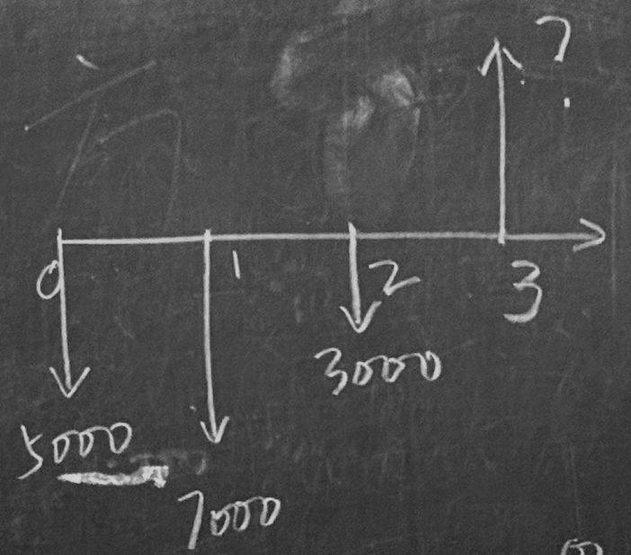

# 货币的时间价值

*公司金融一系列计算的基础*

---

### 第一节 终值和利率

#### 一、终值计算

**终值**（*Final Value*）又叫**未来值**，指现在一笔资金在未来一段时间后所具有的价值

> 假设将 10000 元资金存入银行，银行利率为 3.5% ，一年或者两年后银行存款的价值为多少？
> 
> > *一般默认为复利而非单利，即利滚利*
> 
> - 一年：$10000+10000*3.5\%=10000*(1+3.5\%)$
> 
> - 两年：$10000*(1+3.5\%)+10000*(1+3.5\%)*3.5\%=10000*(1+3.5\%)^2$

对于一个投资其为 $t$ 年，年利率为 $r$ ，初始投资本金为 $C_0$ 的投资，有

- 复利终值计算公式： $FV=C_0*(1+r)^t$

- 单利终值计算公式： $FV=C_0*(1+r*t)$

此时 $C_0$ 即为**现值**（*Present Value*），固有现值终值的关系公式：

$$
FV=PV(1+r)^t
$$

#### 二、多笔现金流量的终值

##### 两笔现金

> 某人 2 年后想买一台计算机，为此计划每年存一笔钱。
> 
> 假设今年存入 5000 元，1 年后存入 7000 元，若银行存款利率为 3.5%，那么 2 年后此人可用于购买计算机的银行存款将为多少？

- 绘制**现金流量图**
  
  - 时间分辨
    
    - 今年：第一年期初
    
    - 1 年后：第一年末
    
    - 2 年后：第二年末
  
  
  
  得出 $FV=5000*(1+3.5\%)^2+7000*(1+3.5\%)$

- 或根据现值终值之比 **<------------------------------------------------------------TODO**

##### 一系列现金

> 假设再推迟一年并在第 2 年末再次存入 3000 元，那么从现在开始 3 年后此人可以利用的存款有多少？

$$
FV=5000*(1+3.5\%)^3+7000*(1+3.5\%)^2+3000*(1+3.5\%)
$$

- *每笔现金流量的终值之和就是多笔现金流的终值*

- 复利呈现指数级增长，故低利率也可以达到可观效力~~只不过现实生活利率比这还要低得多~~

#### 三、复利计算频率

##### 复利计息频率对终值的影响

- 复利计息频率会影响每年的实际利率

- 以年为基础的名义利率会随着频率的增加越来越偏离实际利率

> 名义年利率 8%，每月按复利计息，那么
> 
> - 1 元投资到年末的价值为多少？
> 
> - 年投资收益率为多少？

实际年利率计算公式 **<---------------------------------------------------------------TODO**

##### 名义利率与实际利率的关系

---

### 第二节 现值

*重点*

#### 一、现值和折现

一笔未来的现金流量，其价值往往小于今天等额的现金流量

> ##### 基本事实
> 
> - 人们倾向于当前消费而不是未来消费
>   
>   - 若希望人们未来消费，总会给予一定补偿
> 
> - 通货膨胀时期，货币价值随时间延续而降低
> 
> - 任何未来现金流量的不确定性（风险）都会减少现金流量的价值

##### （一）单一现金流量的现值计算

> 若年利率为 6% ，则
> 
> - 为了在一年后获取 106 元，现在必须投资多少？
> 
> - 未来在两年后获取 112.36 元，现在必须投资多少？

- 现值计算公式： $PV=\frac{FV}{(1+r)^t}=\frac{C_t}{(1+r)^t}$

##### （二）现值系数

$PV=C_t*\frac{1}{(1+r)^t}$，其中 $\frac{1}{(1+r)^t}$ 即为**现值系数**

> *不同时间点的现金流量在比较和相加之前，必须转换为同一时点的现金流量*，即**不同时间的现金流不具备可加性**

##### （三）折现率
