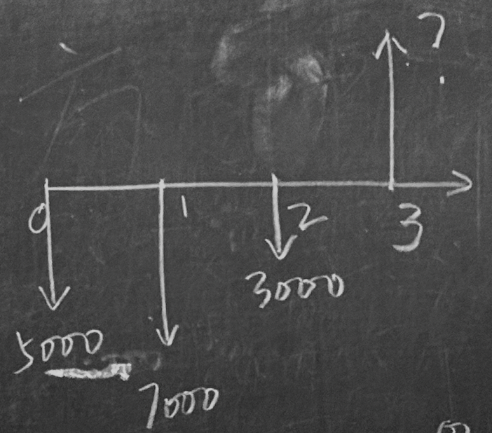
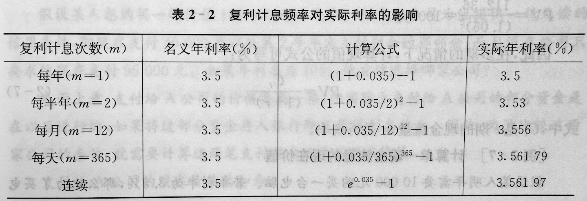
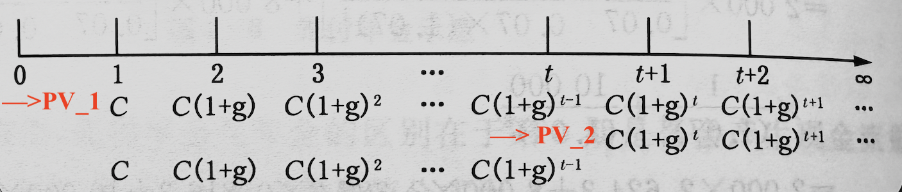

# 货币的时间价值

*公司金融一系列计算的基础*

---

### 第一节 终值和利率

#### 一、终值计算

**终值**（*Final Value*）又叫**未来值**，指现在一笔资金在未来一段时间后所具有的价值

> 假设将 10000 元资金存入银行，银行利率为 3.5% ，一年或者两年后银行存款的价值为多少？
> 
> > *一般默认为复利而非单利，即利滚利*
> 
> - 一年：$10000+10000\times3.5\%=10000\times(1+3.5\%)$
> 
> - 两年：$10000\times(1+3.5\%)+10000\times(1+3.5\%)\times3.5\%=10000\times(1+3.5\%)^2$

对于一个投资其为 $t$ 年，年利率为 $r$ ，初始投资本金为 $C_0$ 的投资，有

- 复利终值计算公式： $FV=C_0\times(1+r)^t$

- 单利终值计算公式： $FV=C_0\times(1+r\times t)$

此时 $C_0$ 即为**现值**（*Present Value*），固有现值终值的关系公式：

$$
FV=PV(1+r)^t
$$

#### 二、多笔现金流量的终值

##### （一）两笔现金

> 某人 2 年后想买一台计算机，为此计划每年存一笔钱。
> 
> 假设今年存入 5000 元，1 年后存入 7000 元，若银行存款利率为 3.5%，那么 2 年后此人可用于购买计算机的银行存款将为多少？

- 绘制**现金流量图**
  
  - 时间分辨
    
    - 今年：第一年期初
    
    - 1 年后：第一年末
    
    - 2 年后：第二年末
  
  
  
  得出 $FV=5000\times(1+3.5\%)^2+7000\times(1+3.5\%)$

##### （二）一系列现金

> 假设再推迟一年并在第 2 年末再次存入 3000 元，那么从现在开始 3 年后此人可以利用的存款有多少？

$$
FV=5000\times(1+3.5\%)^3+7000\times(1+3.5\%)^2+3000\times(1+3.5\%)
$$

- **每笔现金流量的终值之和就是多笔现金流的终值**

- 复利呈现指数级增长，故低利率也可以达到可观效力~~只不过现实生活利率比这还要低得多~~

#### 三、复利计算频率

##### （一）复利计息频率对终值的影响

- 复利计息频率会影响每年的实际利率（*Effective Annual Rate*）

- 以年为基础的名义利率会随着频率的增加越来越偏离实际利率

> 名义年利率 8%，每月按复利计息，那么
> 
> - 1 元投资到年末的价值为多少？
> 
> - 年投资收益率为多少？

###### 实际年利率计算公式

$EAR=(1+\frac{r}{m})^m-1$

- $r$ – 名义年利率

- $m$ – 一年复利计息次数

> 若是**连续复利计息**，实际年利率计算公式应为
> 
> $$
> EAR=e^r-1
> $$
> 
> 其中 $e$ 是一个常数，约为 $2.718$

##### （二）名义利率与实际利率的关系

- 计息周期为 1 年时，名义利率与实际利率相等

- 计息周期少于 1 年时，名义利率小于实际利率

- 名义利率越高，复利计息次数越多，二者的差异也就越大

---

### 第二节 现值

*重点*

#### 一、现值和折现

一笔未来的现金流量，其价值往往小于今天等额的现金流量

> ##### 基本事实
> 
> - 人们倾向于当前消费而不是未来消费
>   
>   - 若希望人们未来消费，总会给予一定补偿
> 
> - 通货膨胀时期，货币价值随时间延续而降低
> 
> - 任何未来现金流量的不确定性（风险）都会减少现金流量的价值

##### （一）单一现金流量的现值计算

> 若年利率为 6% ，则
> 
> - 为了在一年后获取 106 元，现在必须投资多少？
> 
> - 未来在两年后获取 112.36 元，现在必须投资多少？

- 现值计算公式： $PV=\frac{FV}{(1+r)^t}=\frac{C_t}{(1+r)^t}$

##### （二）现值系数

$PV=C_t\times\frac{1}{(1+r)^t}$，其中 $\frac{1}{(1+r)^t}$ 即为**现值系数**

> *不同时间点的现金流量在比较和相加之前，必须转换为同一时点的现金流量*，即**不同时间的现金流不具备可加性**

##### （三）折现率

未来现金流量换算为当前现金流量所使用的比率

> 计算未来现金流量现值的过程即被称为折现

- 折现率的计算公式：

$$
r=(\frac{FV}{PV})^{\frac{1}{t}}-1
$$

- 折现率体现了
  
  - 当前的消费偏好（偏好越大，折现率越高）
  
  - 预期的通货膨胀（通胀越高，折现率越高）
  
  - 未来现金流量的不确定性（风险越高，折现率越高）
  
  > **较高的折现率意味着未来现金流量的现值较低**

##### （四）确定期数

使一笔钱增值到某个已知值所需要的时间

> 现有 10 万元的投资资金，若投资得到的年收益率为 6% ，需要多长时间才能得到 25 万元？
> 
> $\because 10\times(1+6\%)^\frac{1}{t}=25$
> 
> $\therefore t=\frac{\ln1.06}{\ln25}$

#### 二、多笔现金流量的现值

> 计划买车，面临两个选择
> 
> - 一次性支付 15.5 万元
> 
> - 现在支付 8 万元，并在以后的 2 年内每年分别支付 4 万元
> 
> 假设折现率为 8% ，应选择一次性付款还是分期付款？
> 
> - $PV_1=15.5$
> 
> - $PV_2=8+\frac{4}{1+0.08}+\frac{4}{(1+0.08)^2}$

**一系列现金流量的现值就是每笔现金流量的现值之和**

#### 三、四类现金流量的计算

*这四类公式的现值均为**从现在开始一期以后**发生的现金流量*

##### （一）永续年金

*优先股、永久性债券等*

每期保持金额相等发生，且持续到永久的现金流量

没有终止的时间，因此没有终值

$$
PV=\frac{C}{1+r}+\frac{C}{(1+r)^2}+\frac{C}{(1+r)^3}+L
$$

为**收敛的无穷等比数列**，根据公式 $\frac{a}{1-q}$ 得出

$$
PV=\frac{C}{r}
$$

- $C$ – 从现在开始一期后，即发生在第一期期末的现金流量

- $r$ – 折现率

> 当每期的现金流不变时，永续年金的现值会随着利率的下降而增加，反之亦然

##### （二）永续增长年金

有规律地、按照相同比例增长的现金流量

$$
PV=\frac{C}{1+r}+\frac{C\times(1+g)}{(1+r)^2}+\frac{C\times(1+g)^2}{(1+r)^3}+L
$$

若 $q=\frac{1+g}{1+r}$ ，根据数学原理若希望 $PV$ 收敛，必须满足 $q<1$ ，即 $r>g$ 此时方可得出

$$
PV=\frac{C}{r-g}
$$

> 公司今年现金股利每股 0.5 元，预计以后支付的股利将以 2% 的速度增长，若折现率为 8% ，那么股利现值为多少？
> 
> - $r=0.08$ ，$g=0.02$ ，满足 $r>g$
> 
> - $C=C_0\times(1+g)=0.5\times1.02$
> 
> - $\Delta PV=\frac{C}{r-g}=\frac{0.5\times1.02}{0.08-0.02}$
> 
> - $PV=C_0+\Delta PV=0.5+\frac{0.5\times1.02}{0.08-0.02}$

##### （三）年金

某一确定的期间里，每**隔一固定时期**就发生的**等额**现金流量，可以发生在期末也可以发生在期初

> 不做特殊说明一般默认为发生在期末，发生在期初的被称为**先付年金**

###### 1. 已知 $C$ 求 $PV$

$$
PV=C[\frac{1}{r}-\frac{1}{r(1+r)^t}]
$$

- $[\frac{1}{r}-\frac{1}{r(1+r)^t}]$ 即为**年金现值系数**

- 其通分形式常见于会计财务计算 $C[\frac{(1+r)^t-1}{r(1+r)^t}]$
  
  - 年金现值系数可以通过查询**复利系数表**得到，运算简化为 $PV=C(P/A, i, n)$
    
    - $A$ – 此公式中的年金 $C$
    
    - $i$ – 此公式中的折现率 $r$
    
    - $n$ – 此公式中的时间尺度 $t$

###### 2. 已知 $PV$ 求 $C$

*即上式移项变换得到*

$$
A=PV[\frac{r(1+r)^t}{(1+r)^t-1}]=PV[\frac{r}{1-\frac{1}{(1+r)^t}}]
$$

$$
\Leftrightarrow PV(A/P, i, n)
$$

###### 3. 已知 $C$ 求 $FV$

根据 $FV=PV(1+r)^t$ 得出 $PV=\frac{FV}{(1+r)^t}$ ，代入 **1.**

$$
FV=C[\frac{(1+r)^t-1}{r}]
$$

$$
\Leftrightarrow C(F/A, i, n)
$$

- $[\frac{(1+r)^t-1}{r}]$ 即为**年金终值系数**，可以看出即为年金现值系数乘上 $(1+r)^t$ 得到，同样可以借助复利系数表简化计算

- **$FV$ 必须与最后一个 $C$ 在同一时间点**

###### 4. 已知 $FV$ 求 $C$

$$
C=FV[\frac{r}{(1+r)^t-1}]
$$

$$
\Leftrightarrow FV(A/F, i, n)
$$

###### 5. 递延年金

最初的现金流量不是发生在现在，而是 $m$ 期后的年金

$$
PV=C[\frac{(1+r)^t-1}{r(1+r)^t}][\frac{1}{(1+r)^m}]
$$

$$
\Leftrightarrow C(P/A, i, t)(P/F, i, m)
$$

###### 6. 先付年金

发生在某一固定时期**每期期初**会产生等额现金流量的年金

$$
PV=C+C[\frac{(1+r)^t-1}{r(1+r)^t}]
$$

$$
\Leftrightarrow C+C(P/A, i, n)
$$

###### 7. 特殊年金

支付期限超过一年、支付期限不固定、每期产生现金流量不相同等特殊情况下的年金

*将每一期的现金流量分别折现在 0 期或者复利计算到终期，求和*

##### （四）增长年金

在一定期间里以固定比率增长的现金流量

因此现值计算可以视为**两个永续增长年金的现值之差**

$$
PV=PV_1-PV_2=\frac{C}{r-g}-\frac{C(1+g)^t}{r-g} \times \frac{1}{(1+r)^t}
$$

整理得

$$
PV=C[\frac{1}{r-g}-\frac{1}{r-g} \times \frac{(1+g)^t}{(1+r)^t}]
$$

- $r=g$ 时，没有增长效益，公式无意义
