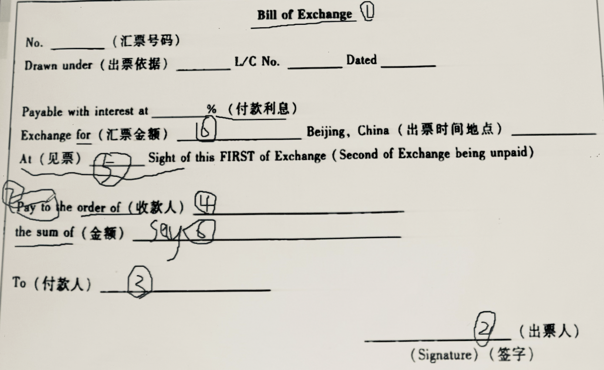

# 国际结算中的票据

---

### 第一节 票据基础

#### 概念

- 广义：有价证券，泛指一切体现商事权利或者具有财产价值的书面凭证，作为所有权证据

- 狭义：*汇票、本票和支票*

#### 转让方式

- 过户转让（*Assignment*）
  
  - 必须书面告知原债务人
  
  - 受让人权利不得优于转让人

- 交付转让（*Delivery*）
  
  - 无需告知原债务人，直接交与票据或在票据背书签字交予受让人
  
  - 受让人权利不得优于转让人

- 流通转让（*Negotiation*）
  
  - 无需告知原债务人，直接交与票据或在票据背书签字交予受让人
  
  - **受让人权利可能优于转让人**，尤见于票据存在缺陷的情况
    
    > ###### 善意和对价
    > 
    > - 善意（*good faith*）：诚实合规且无疏忽的行为，如偶得~~也就是说大街上捡到一张支票不管是谁的你都能用掉甚至卖出去~~
    > 
    > - 对价（*value*）：足以支持一份简单合约的有价约因

#### 特征

- 具有价证券的所有特征 – *产权性、收益性、风险性、期限性*

- 特殊法律特征
  
  - 流通性（*Negotiability*）
    
    - 不必通知债务人
    
    - 受让人不受其前手权利缺陷的影响
  
  - 无因性 – *属于**不必要过问原因**的法律证券*
  
  - 要式性 – *制定及使用时的内容形式均必须符合相关规定*
  
  - 设权性 – *票据权利的发生必须以票据的设立为前提*
    
    - 产生票据权利需要做成票据
    
    - 转让票据权利需要交付票据
    
    - 行使票据权利需要提示票据
  
  - 文义性 – *票据的一切权利均以票据上记载的文字为依据*
    
    - **其它任何事由都不干预权利的行使**
  
  - 提示性 – *付款提示和承兑提示*
  
  - 返还性 – *付款后返还债务人*

#### 作用

- 支付结算

- 资金流通

- 流通

#### 票据法规

- **英国《1882年票据法》**

- 美国《统一流通票据法》 – *参照上法制定*

- **《日内瓦统一法》**

- 《国际汇票和国际本票公约》、《国际支票公约》

- **《中华人民共和国票据法》**，1996 年 1 月 1 日正式生效
  
  - 形式上，采取了三票统一立法的形式
  
  - 内容上，明确了票据的权力义务，规范了票据行为，规定了我国票据法的国际地位

> ##### 冲突处理
> 
> - 有效性以**出票地**法律为准
> 
> - 开立、背书、承兑是否合法，以**行当地**的法律为依据
> 
> - 对于持票人提示承兑/提示付款的责任，对退票通知或拒绝证书的要求均按**行为地**法律解释
> 
> - 国外开立在另一国付款的远期票据，其到期日的计算按照**付款地**的法律规定

---

### 第二节 汇票

*国际结算中最为常见的票据*

#### 定义

- 我国：*出票人签发，委托付款人在见票时或者在指定日期无条件支付确定的金额给收款人或者持票人的票据*

- 英国：*A bill of exchange is an **unconditional** order in writing, addressed by one person to another, **signed** by the person giving it, requiring the person to whom it is addressed to pay on demand or at a fixed or determinable future time a sum certain in money to or to the order of **a specified person, or to bearer**.*

#### 记载项目

##### 八项必要记载项目

1. 名称

2. 出票人

3. 付款人

4. 收款人/持票人

5. 付款期限（缺省意味着即期）

6. 付款金额

7. 无条件支付命令

8. 出票日期和地点（地点有时可缺省）

> ##### Example
> 
> 
> 
> 1. Title: *Bill of exchange/Draft/Exchange*
> 
> 2. *Drawer* & *Signature*
> 
> 3. To: *Person* / *Bearer*
> 
> 4. Pay to the order of
>    
>    - 限制性抬头 – 不能再流通转让
>      
>      - *Pay to XX co. only*
>      
>      - *Pay to XX co. not transferable*
>    
>    - 指示性抬头 – 可流通转让，但仅限于背书
>      
>      - *Pay XX co. or order* （英国常见写法）
>      
>      - *Pay to the order of XXX co.*
>    
>    - 持票人或来人抬头 – 交付转让
>      
>      - *Pay to Bearer*
>      
>      - *Pay to XXX co. or Bearer*
> 
> 5. Date
>    
>    - 即期 – *At Sight*
>    
>    - 远期
>      
>      - *At XXX after Sight* – 见票日期
>      
>      - *At XXX after date* – 出票日期
>      
>      - *At XXX after shipment* – 海运提单日期
>      
>      - *the fixed date* – 固定日期
>    
>    > 计算方法
>    > 
>    > - 算尾不算头
>    > 
>    > - 假日顺延
>    > 
>    > - 月为日历月
>    > 
>    > - 到期日无相同日期即为该月最后一天
> 
> 6. Money
>    
>    - *(Exchange) for* – 小写
>      
>      - eg. USD 500,000
>    
>    - *the sum of* – 大写
>    
>    - *Payable with interest at* – 利息，没有可省略
>    
>    > 应当为**确定金额**，明确利息和汇率
>    > 
>    > *current rate* 有歧义不算作确定金额
> 
> 7. *Pay to*
>    
>    - 应当为祈使句，无情绪词
>    
>    > 若有，也只认为是礼貌目的，无请求意味
> 
> 8. *Beijing, China XXX*

#### 当事人

#### 票据行为

#### 贴现

#### 种类

---

### 第三节 本票

---

### 第四节 支票

---