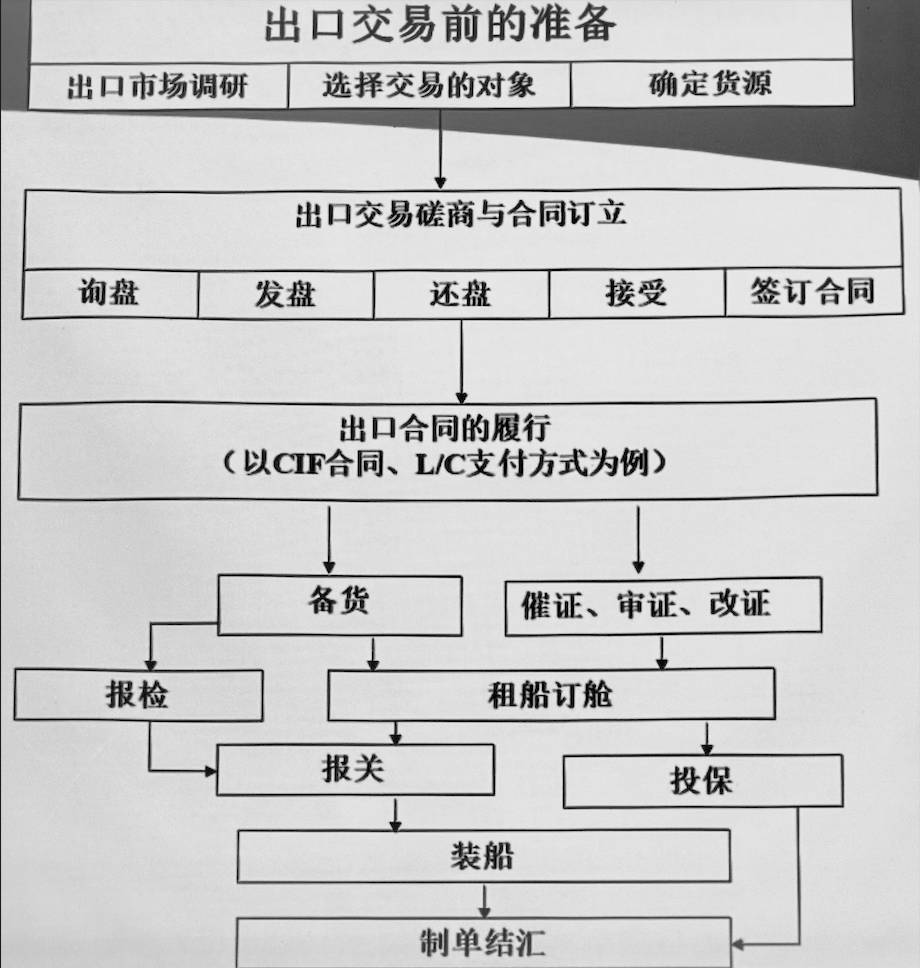
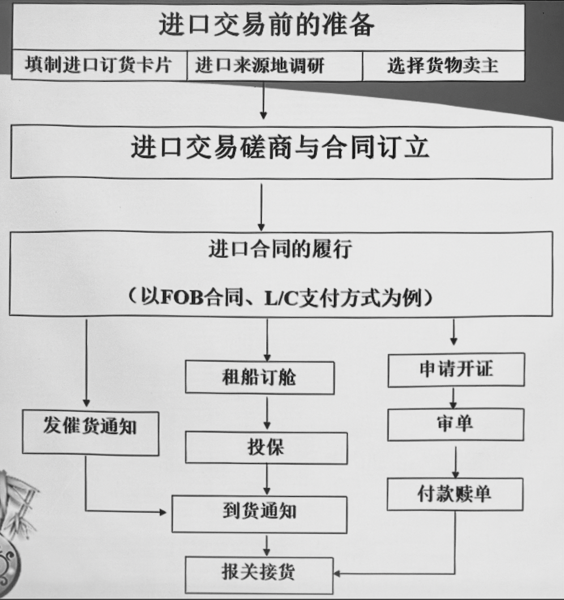

# 绪论

*大三唯一选修课*

*开卷考试，没有补考*

*该课程亦需要多学科知识的支撑*

- 商务英语、国际贸易磋商、运输与保险、单证、经济法、国际商法、各国政策……

## 梳理

- 国际货物贸易的特点
  
  即**进出口贸易**
  
  - 狭义：国与国之间的有形商品即货物买卖活动，也是国际贸易中最基本最主要的部分
  
  - 广义：
    
    - 货物进出口
    
    - 技术进出口 – *以许可贸易为主要形式的技术转让*
    
    - 服务进出口 – *交通运输、银行保险、旅游、船舶维修、技术咨询、各种形式的劳务合作等*

- 有关国际贸易的法律与惯例

- 国际贸易应遵循的准则

- 进出口贸易的一般业务程序

- 国际货物买卖合同

- 国际贸易实务课程的主要内容

## 学习方法

- 贯彻理论联系实际原则

- 注意业务同法律的关系

- 加强英语的学习

- 注意本课程同其他相关课程的联系

- 注重学以致用

---

### 一、国际货物贸易的特点

*两个字：复杂*

#### （一）特点

- **法律法规**的复杂性
  
  - 多国法规介入，常伴随矛盾冲突

- **交易过程**的复杂性
  
  - 报关报检
  
  - 银行结算
  
  - 保险公司投保等

- **经营环境**的复杂性
  
  - 交易对方的资信信息难以核实确认

- **政治经济环境**的复杂性

- 国际贸易中的**竞争异常激烈** – *Fact.*

#### （二）风险及其防范

> 交易金额大、时间间隔长、地理跨度长、多种运输方式结合、海盗活动或恐怖分子的蓄意破坏

##### 交易双方的信用风险

*亦称违约风险*

- 通过信用调查，事前选择良好客户

- 加强对应收账款的监控，催收应收账款

- **出口信用险**

##### 货物的运输风险

- 选取实力强、信誉好的运输公司

- **运输保险**

##### 汇率波动风险

- 本币计价法，即本币支付 – *完全规避汇率问题*

- 收硬付软法
  
  - 收取硬币（俗称更值钱的，将要升值的货币）
  
  - 支付软币（俗称贱币，将要贬值的货币）

- 缩短报价或收付的有效期

- 价格调整法 – *根据汇率波动区间调整价格*

- 外汇保值法，即外汇保值条款 – *硬币计价，软币支付*

- 金融业务对冲法等

##### 政治风险

*往往无法防范，只能通过对时政的了解回避，但最理想的防范措施只有投保一种*

- **政治风险保险**

##### 贸易欺诈风险

*往往由精通贸易政策的组织相互勾结利用漏洞实施诈骗，唯一有效方法只有积累相关知识注重辨别*

##### 法律体系不同产生的风险

*了解多国法律制度，对于国际贸易更须学习国际商法*

> #### 应对风险的共同方法
> 
> - 风险回避 – *源头上杜绝风险行为*
> 
> - 风险自担/风险自留 – *主动承担风险，不将其计入成本，常见于低损失风险*
> 
> - 风险转移 – *投保*
> 
> - 风险控制
>   
>   - 事前 – *预防*
>   
>   - 事中 – *发生时采取措施降低损失*
>   
>   - 事后 – *亡羊补牢*
> 
> *对于国际贸易来说，风险回避和风险自担并不现实～*

---

### 二、有关国际贸易的法律与惯例

- 各国国内法律
  
  - 由国家制定或认可并在本国主权管辖范围内生效的法律
  
  - 国家选择
    
    - 意思自治原则 – *甲乙双方共同约定*
    
    - 最密切联系原则 – *若未在合同约定，则使用与合同由最密切联系的国家的法律*

- 国际条约或公约
  
  - **效力优先于国内法**
  
  > 条约：两个国家共同认可签订
  > 
  > 公约：两个以上国家共同认可签订
  > 
  > > 《**公约**》在有些语境也作为《**联合国国际货物贸易销售合同**》这一公约的简称

- 国际贸易惯例
  
  长期国际贸易活动中逐渐形成、被大家认可的习惯做法被编纂成文后的结果
  
  - 不具有法律效力，也不具有普遍的强制性 – *非强制！*
  
  - 适用以当事人的**意思自治**为原则 – *可协商！*
  
  - 使用时可以对其中某项或几项进行更改或补充 – *可以改！*
  
  > ##### 赋予法律效力的办法
  > 
  > - 在合同中约定说明 – 利用*合同法*
  > 
  > - 立法规定
  >   
  >   - 《公约》规定了部分**即使不明确说明也理应知道并遵守**的惯例

---

### 三、国际贸易应遵循的准则

- 当事人法律地位平等

- 缔约自由

- 公平平等

- 诚实信用

- 恪守合同

- 遵守法律

---

### 四、进出口贸易的一般业务程序

#### （一）出口贸易的基本流程

##### 交易前的准备工作

- 国外市场与客户调查

- 制定商品经营方案

- 广告宣传与促销

- 选择交易对象

- 落实货源做好备货

##### 交易磋商

- 方式：口头、函电

- 内容：品名、品质、数量、包装、价格、运输、保险、支付、商检、索赔、冲裁、不可抗力（*Force Majeure*）等

- 程序
  
  *询盘 – 发盘 – 还盘 – 接受 – 签合同* 
  
  *Inquiring – Offer – Counter Offer – Acceptance – Contract*
  
  ~~问价—报价—还价—达成共识—我订了~~

##### 履行合同

最常见的有：**CIF + 信用证方式**

> 信用证简单来讲就是银行的付款承诺，使第三方证明
> 
> 英文名 *Letter of Credit*，简称 *L/C*

1. 备货

2. 催征、审证、改证（即指信用证）

3. 租船订舱；安排运输保险；办理出口报关和保险手续
   
   - **CIF** 公约下由卖方办理运输保险

4. 缮制备妥出口单据

5. 交单结汇、收取货款

#### （二）进口贸易的基本流程

##### 交易前的准备工作和磋商

*同出口贸易流程*

##### 履行合同

最常见的有：**FOB + 信用证方式**

- 申请开立信用证

- 租船订舱；催促卖方备货装船；投保
  
  - **FOB** 术语下由买方办理运输保险

- 审核相关单据；单证相符则付款赎单

- 办理进口报关手续，纳税；验收货物

---

### 五、国际货物买卖合同

#### （一）国际货物买卖活动中的合同种类

- 与国内供货方订立**购货合同** – *供货合同*

- 与承运方订立**运输合同** – *国内运输和国际运输*

- 与保险公司订立**保险合同**

- 与买卖方订立**交易合同**等，不一一列举

#### （二）“国际性”的判定标准

指**营业地**在**不同国家**的当事人之间的货物买卖

#### （三）国际货物买卖合同的概念

营业地在不同国家的当事人之间订立的就**一方交付货物、另一方支付贷款**的有关事项的协议

#### （四）国际货物买卖合同的主要内容

- 约首
  
  - 双方信息 – *名称、日期、地点、联系方式等*

- 基本条款 – *可见于磋商内容*

- 约尾
  
  - 双方签名

---

### 六、国际贸易实务课程的主要内容

#### （一）有关国际货物贸易的法律与惯例

*将于合同条款中对应学习*

#### （二）合同条款

***重点！！！***

#### （三）合同的商定和履行

#### （四）贸易方式