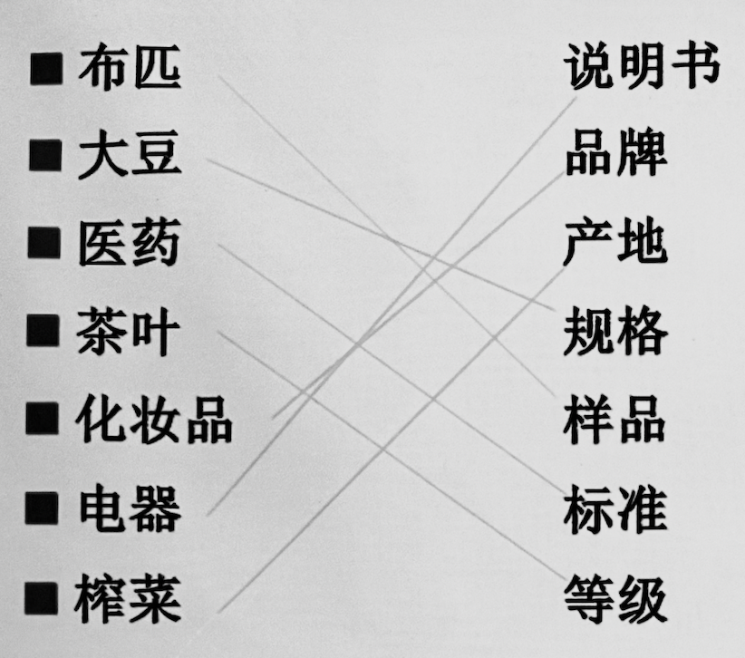

# 商品的品名、品质、数量和包装

---

### 第一节 商品的品名

#### 一、含义

即**商品名称**（*Name of Commodity*），使其区别于其他商品的一种称呼或概念，作为构成国际货物买卖合同的必要条件

#### 二、意义

- 商贸角度 – *交易的基础*
  
  是**交易**赖以进行的**物质基础和前提**，以此为前提下才能进行其他商贸活动的磋商

- 法律角度 – *履约的依据*
  
  是买卖双方的基本权利和义务，是**货物交收的基本依据**之一

- 实务角度 – *统计收费的依据*
  
  是商业外贸**统计的依据**，也是各项实务中**收费的依据**

> ##### 常见命名方法
> 
> 依据用途、原材料、主要成分、外观造型、褒义词、人物地名、制作工艺等方式
> 
> 有时会增加品种、等级、型号或产地等特化描述，此时品名与品质条款合并 – *长虹37寸液晶电视机*

#### 三、品名条款的基本内容

> 合同、单据、实物内外包装等处的品名应永远一致

详见教材

#### 四、规定品名条款的注意事项

- 内容应**明确、具体**

- 货物名称描述应该**实事求是**，禁止虚假夸大宣传
  
  > ~~杜绝一扫光~~

- 尽可能**国际化**，一般采用国际通用名称

- 必须考虑**货物名称与运费关系以及海外税则**的规定，根据是否有利于减低关税、方便进出口和节省运费命名
  
  > 重晶石粉和硫酸钡粉是一种物质的两种名字
  > 
  > 前者出口需要 10% 关税，选择后者可以**合理避税**

- 同一合同中，同一商品使用一致名称

- 译名应通俗且合理易懂

- **防止侵权**，不要使用涉及外国商品名称专用权或者制造方法专用权的名称 – *青霉素而非盘尼西林*

---

### 第二节 商品的品质

#### 一、含义

即**商品质量**（*Quality of Goods*），商品内在品质和外观形态的综合

#### 二、意义

*同品名的意义*

> *Quality is the most important factor in the sale of goods.*
> 
> *According to UN Convention, the seller must deliver the goods as required by the contract.* – *卖方根据合同提交货物*
> 
> *Otherwise, the buyer may claim damages, require delivery of substitute goods, or require the seller to remedy, or even reject the goods, and cancel the contract.* – *若货物质量与合同有异，卖方有权要求损害赔偿/替换/修复/拒收/拒绝履行合同*

- 品质低于或高于合同描述均算作违约
  
  > 因为存在兼容性、保养/运输成本、销售成本、目标群体、市场价格倾向等多方面原因，品质高于合同描述仍被拒收的案例实际并不少见

#### 三、表示方法

> 现实案例：2022年买方买入一批铸钢锄头，却受到了铸铁锄头
> 
> 卖方表示货物与**样品**无异，拒绝赔偿

##### 实物表示方法

- 看货买卖（*Sale by Actual Quality*）
  
  只要卖方交易的是验看过的货物，买方不得对品质提出异议
  
  > 常见于：贵重物品的现货交易

- 凭样品买卖（*Sale by Sample*）
  
  - 凭卖方样品买卖
    
    - 参考样品（*Reference Sample*）：卖方用来宣传介绍推销的样品，不是交货品质的最终依据
    
    - 标准样品（*Standard Sample*）：又称成交样品，实际交货样品应与其品质保持一致，也就是买卖双方成交货物的最终品质依据
    
    > ###### 注意事项
    > 
    > - 卖方样品必须具有代表性
    > 
    > - 卖方寄出样品时需要保留“复样”或“留样”，并且妥善保管以保证品质稳定
    >   
    >   > 往往需要长期留存，作为复验期后发生纠纷时的关键证据
    > 
    > - 避免参考样品和标准样品混淆，寄送时加注“样品仅供参考（*Sample for Reference Only*）”标志
  
  - 凭买房样品买卖
    
    在我国也称作来样提交、来样制作
    
    > ###### 注意事项
    > 
    > - 工业产权等**第三者权利**的问题
    >   
    >   > 卖方应力争在合同中订明
    >   > 
    >   > *“本企业对由买方来样引起侵犯第三者工业产权的事情不负责任，由此给卖方造成的损失由买方承担。”*
    >   
    >   > 《公约》第 42 条亦有规定：*若卖方按照买方的提供的技术图纸、规格等进行生产和交货，而第三方根据工业产权或其他知识产权要求任何权利或任何要求时，卖方可不负责任*
  
  - 凭对等样品买卖（回样）
    
    > 现实案例：*达成交易后发现有些指标无法完成*
    
    卖方先根据买方提供的样品，加工复制出一个类似的样品交买方确认无误后再决定是否交易
    
    *在我国最为常见的样品买卖方式即为凭对等样品*
  
  > ###### 注意事项
  > 
  > - 卖方应力争弹性条款 – *大致* / *基本* ，买方相反 – *完全* ~~诡计多端的资本家~~
  > 
  > - 以样品表示品质的方法只能**酌情采用**
  > 
  > - 凡凭样品买卖，卖方交货品质必须与样品**完全一致**

##### 文字表示方法

- 凭规格买卖（*Sale by Specification*）
  
  反应品质的主要指标，如化学成分、含量、纯度等

- 凭等级买卖（*Sale by Grade*）
  
  同一类产品的差异，一级、二级；甲等、丙等

- 凭标准买卖（*Sale by Standard*）
  
  符合 XXX 企业/国家/国际标准，国际贸易中最常见的是**国际标准化组织ISO**制定的标准
  
  > ###### 附加知识
  > 
  > *农副产品等品质差异较大而难以规定统一标准的产品采用方法*
  > 
  > - 良好平均品质（*Fair Average Quality, F.A.Q.*）
  >   
  >   指一定时期内某地出口货物的平均品质水平，即中等货，我国俗称**大路货**
  > 
  > - 上好可销品质（*Good Merchantable Quality, G.M.Q*）
  >   
  >   即**上等货**

- 凭品牌或商标买卖

- 凭产地名称买卖

- 凭说明书和图样买卖
  
  适用于技术密集型产品，附加详细规格文字说明与图样的买卖

> ##### 辨析举例
> 
> 

#### 四、合同中的品质条款

##### 注意事项

- 尽量采用一种方法表示，避免双重担保
  
  - 避免同时用文字和样品等多种表示方法描述

- 考虑实际生产加工、供货的可能性
  
  - 不要急于求成～

- 尊重对方贸易权利，符合对方国家习俗法律条例的规定
  
  - 常见于伊斯兰等宗教信仰广泛存在的国家

- 简明、切合实际，**对某些商品可规定增加一些品质机动条款**

##### 品质机动幅度

允许卖方品质有一定机动范围。只要未超出机动幅度的范围便不算作违约

> 主要适用于：初级产品、某些工业加工品

- 范围 – *活黄鳝 每条70/75克*

- 极限 – *脂肪含量 <= 5%*

> 为防止卖方以最低限度质量压缩成本，可设置**品质增减价条款**按质论价
> 
> - 在范围内质量越高，合同价格越高，反之亦然

##### 品质公差

国际公认的产品品质的误差（某些产品的公认特点）

即使没有在合同规定，只要在品质公差范围内，买方不得根据品质增减价条款调整价格

---

### 第三节 商品的数量

#### 一、计量单位

##### 长度

> 米（*metre*）｜厘米（*centimetre*）
> 
> 英尺（*foot*）｜英寸（*inch*）
> 
> 码（*yard*）
> 
> 1 metre = 1.0936 yards
> 
> 1 metre = 3.2808 feet
> 
> 1 yard = 3 feet
> 
> 1 foot = 12 inches

##### 重量

| 中文  | 英文         | 英文简写 | 标准化换算       |
| --- | ---------- | ---- | ----------- |
| 公吨  | metric ton | M/T  | 1000 kg     |
| 长吨  | long ton   | L/T  | 1016.047 kg |
| 短吨  | short ton  | S/T  | 907.184 kg  |
| 千克  | kilogram   | kg   | 1000 g      |
| 克   | gram       | g    | 0.001 kg    |
| 盎司  | ounce      | oz   | 28.35 g     |
| 磅   | pound      | lb   | 453 g       |

##### 面积

- 平方米（*square metre*）

- 平方英尺（*square foot*）

- 平方码（*square foot*）

- *1 square metre = 10.7636 square feet = 1.196 square yards*

##### 容积

- 公升（*litre*）

- 加仑（*gallon*） – *流体货物*

- 蒲式耳（*bushel*） – *谷物*

- *1 litre = 0.22 gallons*

- *1 bushel = 8 gallons*

##### 体积

- 立方米（*cubic metre*）

- 立方英尺（*cubic foot*）

- 立方码（*cubic yard*）

- *1 cubic metre = 35.313 cubic feet = 1.308 cubic yard*

##### 数量

- 辆（*unit*）

- 袋（*bag*）

- 包（*bale*）

- 双（*pair*）

- 卷（*roll/coil*）

- 箱（*carton/case*）
  
  - 纸箱（*carton*）
  
  - 木箱（*wooden case*）
  
  - 集装箱（*container*）

- 桶（*barrel/drum*）

- 头（*head*）

- 件（*package/pkg*）

- 只（*piece/pc*）

- 打（*dozen/doz*）
  
  - *1 doz = 12*

- 令（*ream/rm*），念做领
  
  - *1 rm = 480 张（英制）/ 500张（美制）*

- 罗（*gross/gr*）
  
  - *1 gr = 12 doz*

- 台、套、架（*set*）
