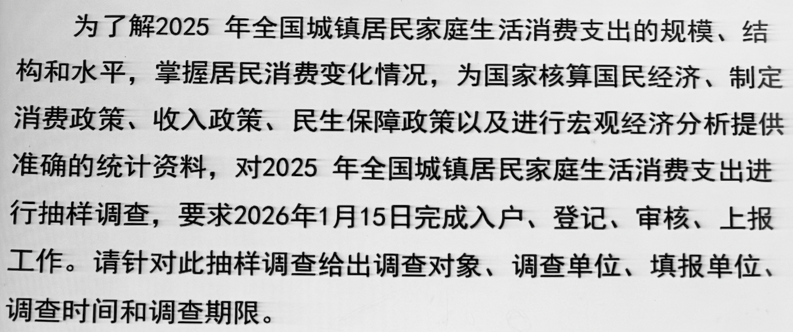

# 统计调查

~~*统计设计阶段基本没有教学价值*~~

---

### 第一节 统计调查概述

#### 一、意义和特点

##### 意义

统计调查即为根据统计研究的目的和任务，采用科学的调查方法，有组织、有计划地搜集统计各种**原始资料**和**次级资料**的工作过程

- 原始资料
  
  - 又称第一手数据、直接获取的数据
  
  - 指向总体单位**直接搜集**的，来源于**直接的调查和科学实验**的第一手研究数据

- 次级资料
  
  - 又称第二手数据、间接获取的数据
  
  - 指已经经过某个部门或地区加工整理过的，来源于**别人调查和科学实验**的第二手统计数据

> ###### 不同领域数据获取方法不同
> 
> - 社会科学领域 – *统计调查*
> 
> - 自然科学领域 – *科学实验*
> 
> ###### 不同数据获取途径不同
> 
> - 公开数据 – *网络、出版物等*
> 
> - 非公开数据 – *向购买或委托数据调查机构*

##### 特点

- 数量性 – *搜集到的是数字资料*

- 大量性 – *总需要对调查对象中足够多的个体进行调查*

- 总体性 – *目的是反映调查的总体的数量特征*

#### 二、作用和基本要求

*介于设计和整理之间，是整理分析的基础和前提，在整个统计研究中占有十分重要的地位*

##### 作用

- 是认识社会的基本方式

- 为国家管理和现代企业管理提供基本统计资料
  
  - 管理活动总要建立在数据分析上

- 获得的资料是进行经济预测的重要依据
  
  - 是宏观经济学做预测/回归模型的基础

- 是实施经济评价的重要基础

##### 基本要求

*必须保证**数据质量**，才能作为管理、预测、评价的依据*

- 准确性 – *必须符合客观实际，**真实**可靠*

- 及时性 – *要在统计调查要求的时间内，**尽快**提供*

- 全面性 – *将所要调查的单位的资料**全部**搜集起来*

> *准确性是基础，要在准确性中求及时性和全面性*

#### 三、统计调查的种类 \*重点

##### 按照被研究总体的范围不同

- 全面调查
  
  仅针对有限总体，对总体中全部单位对象进行调查
  
  - 普查

- 非全面调查
  
  又称部分调查，关键在于如何选择部分个体的问题
  
  - 抽样调查 – *随机抽取*
  
  - 重点调查 – *选取重点单位*
  
  - 典型调查 – *选取典型单位*

##### 按照调查登记时间的连续型不同

- 经常性调查 – *连续性调查*
  
  - 根据对象情况的变化，随时将变化情况记录的调查过程
  
  - 可以反映现象的发展过程

- 一次性调查 – *非连续性调查*
  
  - 只需间隔一定时间了解现象在**某一时点**的状况
  
  - 适用于调查对象短期内不会变化的情况

##### 按照组织方式不同

- 定期统计报表调查
  
  - 按一定表式和要求，自上而下布置，自下而上提供统计资料的调查方式
  
  - 又称统计报表制度，是我国长期统计调查中一种行之有效的调查方式
  
  - 本身没有研究目的性，是统一的惯例性调查

- 专门调查
  
  - 为了研究某些专门问题，由进行调查的单位进行专门组织的调查方式

> 注意调查的分类之间可以相互交叉
> 
> 普查：*专门组织的一次性的全面调查*

---

### 第二节 统计调查方案

#### 一、确定调查目的

- 根据党和政府的方针政策

- 抓住主要矛盾，突出调查中心

#### 二、确定调查对象、调查单位和填报单位 \*重点

*回答向谁调查、由谁提供数据的问题*

##### 调查对象

需要调查的社会经济现象的**总体**，由性质上相同的许多调查单位组成 – *all*

##### 调查单位

所要调查对象的**具体单位**，是调查项目的承担者 – *every single one*

##### 填报单位

又称报告单位，负责向上报告调查内容的单位

若调查单位具备向上报送资料能力，则调查填报相同

> 例：调查某区域每一地块的粮食生产状况时，调查单位是每一个地块，自然不具备报送能力，填报单位可能是承包户/村庄

#### 三、确定调查项目和制定调查表

##### 调查项目

指需要向调查单位登记的那些标志，其全体构成调查的内容

- 考虑**需要**，亦要考虑**可能**

- 表述必须**明确、统一、易懂**，不能模棱两可~~杜绝传话效应~~

- 列入的调查项目之间应尽可能**相互联系**，还应考虑此次调查同以往同类调查的调查项目之间的**衔接** – *为时空对比分析考虑*

##### 调查表

将调查提纲中各个项目按照一定顺序排列在一定的表格中形成

###### 内容

- 表头 – *基本为名称，反映调查内容*

- 表体 – *调查表的主体内容，罗列项目的位置*

- 表尾 – *落款人等信息*

###### 形式

- 单一表 – *如人口普查登记表*
  
  - 每张表只登记一个调查单位
  
  - 可以容纳较多的调查项目

- 一览表 – *如暂住人口查询表*
  
  - 一张表上登记若干个调查单位
  
  - 调查项目不能过多

###### 填表说明

一般包含调查项目解释、数据计算方法、填表时的注意事项等

#### 四、确定调查时间和调查期限 \*重点

##### 调查时间

指*调查资料*所属的时间，即所谓的**客观时间**，也就是**调查资料所反映的社会经济现象客观存在的时间**

- 调查时期 – *如全年销量*
  
  - 适用于有可加性的**时期现象**
  
  - 表现为需要明确起止时间

- 调查时点 – *设备数量、人数*
  
  - 适用于不可或不能累加的**时点现象**
  
  - 表现为需要明确具体时间点，即**标准时点**

##### 调查期限

指*调查工作*从开始到结束所**需要的时间**，包含搜集资料到报送资料整个工作过程所需要的时间

> 我国第六次人口普查明确规定 2010.11.1 零时为标准时点 – *调查时间#调查时点*
> 
> 要求 2010.11.10 以前完成普查登记 – *调查期限* ~~此处未含报送时间并不严谨~~

#### 五、制定调查的组织实施计划

- 组织领导机构和调查人员

- 确定调查的方式和方法

- 备好调查经费

- 做好调查前的准备工作 – *人员培训、资料打印等*

> #### 案例分析
> 
> 
> 
> - 调查对象：全国所有的城镇居民家庭
> 
> - 调查单位：全国每一户城镇居民家庭
> 
> - 填报单位：全国每一户城镇居民家庭
> 
> - 调查时间：2025.1.1—2025.12.31
> 
> - 调查期限：2026.1.1—2026.1.15

---

### 第三节 统计调查方式 \*重点

---

### 第四节 统计调查方法和技巧
