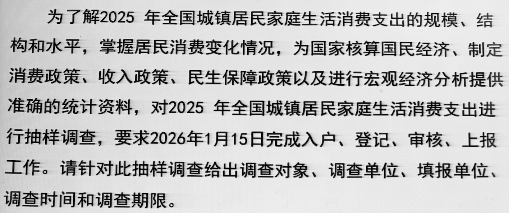

# 统计调查

~~*统计设计阶段基本没有教学价值*~~

---

### 第一节 统计调查概述

#### 一、意义和特点

##### 意义

统计调查即为根据统计研究的目的和任务，采用科学的调查方法，有组织、有计划地搜集统计各种**原始资料**和**次级资料**的工作过程

- 原始资料
  
  - 又称第一手数据、直接获取的数据
  
  - 指向总体单位**直接搜集**的，来源于**直接的调查和科学实验**的第一手研究数据

- 次级资料
  
  - 又称第二手数据、间接获取的数据
  
  - 指已经经过某个部门或地区加工整理过的，来源于**别人调查和科学实验**的第二手统计数据

> ###### 不同领域数据获取方法不同
> 
> - 社会科学领域 – *统计调查*
> 
> - 自然科学领域 – *科学实验*
> 
> ###### 不同数据获取途径不同
> 
> - 公开数据 – *网络、出版物等*
> 
> - 非公开数据 – *向购买或委托数据调查机构*

##### 特点

- 数量性 – *搜集到的是数字资料*

- 大量性 – *总需要对调查对象中足够多的个体进行调查*

- 总体性 – *目的是反映调查的总体的数量特征*

#### 二、作用和基本要求

*介于设计和整理之间，是整理分析的基础和前提，在整个统计研究中占有十分重要的地位*

##### 作用

- 是认识社会的基本方式

- 为国家管理和现代企业管理提供基本统计资料
  
  - 管理活动总要建立在数据分析上

- 获得的资料是进行经济预测的重要依据
  
  - 是宏观经济学做预测/回归模型的基础

- 是实施经济评价的重要基础

##### 基本要求

*必须保证**数据质量**，才能作为管理、预测、评价的依据*

- 准确性 – *必须符合客观实际，**真实**可靠*

- 及时性 – *要在统计调查要求的时间内，**尽快**提供*

- 全面性 – *将所要调查的单位的资料**全部**搜集起来*

> *准确性是基础，要在准确性中求及时性和全面性*

#### 三、统计调查的种类 \*重点

##### 按照被研究总体的范围不同

- 全面调查
  
  仅针对有限总体，对总体中全部单位对象进行调查
  
  - 普查

- 非全面调查
  
  又称部分调查，关键在于如何选择部分个体的问题
  
  - 抽样调查 – *随机抽取*
  
  - 重点调查 – *选取重点单位*
  
  - 典型调查 – *选取典型单位*

##### 按照调查登记时间的连续型不同

- 经常性调查 – *连续性调查*
  
  - 根据对象情况的变化，随时将变化情况记录的调查过程
  
  - 可以反映现象的发展过程

- 一次性调查 – *非连续性调查*
  
  - 只需间隔一定时间了解现象在**某一时点**的状况
  
  - 适用于调查对象短期内不会变化的情况

##### 按照组织方式不同

- 定期统计报表调查
  
  - 按一定表式和要求，自上而下布置，自下而上提供统计资料的调查方式
  
  - 又称统计报表制度，是我国长期统计调查中一种行之有效的调查方式
  
  - 本身没有研究目的性，是统一的惯例性调查

- 专门调查
  
  - 为了研究某些专门问题，由进行调查的单位进行专门组织的调查方式

> 注意调查的分类之间可以相互交叉
> 
> 普查：*专门组织的一次性的全面调查*

---

### 第二节 统计调查方案

#### 一、确定调查目的

- 根据党和政府的方针政策

- 抓住主要矛盾，突出调查中心

#### 二、确定调查对象、调查单位和填报单位 \*重点

*回答向谁调查、由谁提供数据的问题*

##### 调查对象

需要调查的社会经济现象的**总体**，由性质上相同的许多调查单位组成 – *all*

##### 调查单位

所要调查对象的**具体单位**，是调查项目的承担者 – *every single one*

##### 填报单位

又称报告单位，负责向上报告调查内容的单位

若调查单位具备向上报送资料能力，则调查填报相同

> 例：调查某区域每一地块的粮食生产状况时，调查单位是每一个地块，自然不具备报送能力，填报单位可能是承包户/村庄

#### 三、确定调查项目和制定调查表

##### 调查项目

指需要向调查单位登记的那些标志，其全体构成调查的内容

- 考虑**需要**，亦要考虑**可能**

- 表述必须**明确、统一、易懂**，不能模棱两可~~杜绝传话效应~~

- 列入的调查项目之间应尽可能**相互联系**，还应考虑此次调查同以往同类调查的调查项目之间的**衔接** – *为时空对比分析考虑*

##### 调查表

将调查提纲中各个项目按照一定顺序排列在一定的表格中形成

###### 内容

- 表头 – *基本为名称，反映调查内容*

- 表体 – *调查表的主体内容，罗列项目的位置*

- 表尾 – *落款人等信息*

###### 形式

- 单一表 – *如人口普查登记表*
  
  - 每张表只登记一个调查单位
  
  - 可以容纳较多的调查项目

- 一览表 – *如暂住人口查询表*
  
  - 一张表上登记若干个调查单位
  
  - 调查项目不能过多

###### 填表说明

一般包含调查项目解释、数据计算方法、填表时的注意事项等

#### 四、确定调查时间和调查期限 \*重点

##### 调查时间

指*调查资料*所属的时间，即所谓的**客观时间**，也就是**调查资料所反映的社会经济现象客观存在的时间**

- 调查时期 – *如全年销量*
  
  - 适用于有可加性的**时期现象**
  
  - 表现为需要明确起止时间

- 调查时点 – *设备数量、人数*
  
  - 适用于不可或不能累加的**时点现象**
  
  - 表现为需要明确具体时间点，即**标准时点**

##### 调查期限

指*调查工作*从开始到结束所**需要的时间**，包含搜集资料到报送资料整个工作过程所需要的时间

> 我国第六次人口普查明确规定 2010.11.1 零时为标准时点 – *调查时间#调查时点*
> 
> 要求 2010.11.10 以前完成普查登记 – *调查期限* ~~此处未含报送时间并不严谨~~

#### 五、制定调查的组织实施计划

- 组织领导机构和调查人员

- 确定调查的方式和方法

- 备好调查经费

- 做好调查前的准备工作 – *人员培训、资料打印等*

> #### 案例分析
> 
> 
> 
> - 调查对象：全国所有的城镇居民家庭
> 
> - 调查单位：全国每一户城镇居民家庭
> 
> - 填报单位：全国每一户城镇居民家庭
> 
> - 调查时间：2025.1.1—2025.12.31
> 
> - 调查期限：2026.1.1—2026.1.15

#### 六、设计调查问卷

##### （一）基本内容

- 问卷标题

- 封面信

- 指导语

- 问题与答案

- 编码 – *将问题转换成数字的工作*

- 调查事实情况记录

##### （二）问卷的设计方法

###### 总体框架设计

从研究目的出发，找出所要研究对象的**中心概念**，将概念**逐步分解**成为可提出的一个个**提问语句**

###### 问卷问句的设计

1. 主要形式
   
   - 外部形式上分为
     
     - 封闭式问题 – *便于填写、处理分析，但失去了自主性*
     
     - 开放式问题 – *获得资料比较生动，但花费时间精力较多，要求被调查者有较高知识水平和文字表达能力，意见分散时难以综合、赋值量化*
   
   - 内容上分为
     
     - 特征问题 – *用于了解被调查者基本情况*
     
     - 行为问题 – *用于了解被调查者过去发生/正在进行的行为及其后果*
       
       - 调查被调查者本人
       
       - 通过被调查者了解他人
       
       - 调查行为对人们行为后果
     
     - 态度问题 – *被调查者对某一事物的态度、意见、想法、兴趣等，在问卷中占比最大*
   
   - 提问方式上分为
     
     - 直接问题 – *直接提问*
     
     - 间接问题 – *针对被调查者不愿/不敢说出自己真实想法时涉及的问题，可以消除被调查者思想顾虑*
       
       > 如：给出四种对某一事件处理方式，提问被调查者更倾向哪一种
     
     - 假设问题 – *针对用来反映未来意向、将来的打算等*

2. 问卷问题应注意的问题
   
   - 简短明了
   
   - 定类问题应具**穷尽性、互斥性**
   
   - 定距问题的组不应太多，**注意同质性**
   
   - 定序问题往往采取两种形式
     
     - 很满意、满意、中立、不满意、很不满意
     
     - 满意、中立、不满意

3. 问卷答案的格式
   
   - 填空式
   
   - 选择式
   
   - 排序式 – *从所给答案中选出几个并按照重要程度排序*
   
   - 矩阵式 – *针对某一方面情况，将所提出一系列问题设计成一组相同定序形式，由被调查者从不同方面回答*
   
   - 表格式 – *矩阵式的延伸，可获取更开放的资料*

###### （三）问卷设计时应注意的问题

- 考虑被调查者的回答能力

- 问题数量要适中

- 注意问卷中问题的先后顺序
  
  - 由易到难
  
  - 由容易吸引到容易产生疑虑
  
  - 由行为问题到态度问题
  
  - 由看法到个人背景
  
  - 若有开放式问题，往往放在最后
  
  - 问题排列应该有逻辑顺序

---

### 第三节 统计调查方式 \*重点

#### 一、普查

##### （一）概念

*一种专门组织的、一次性的全面调查*

- 主要用来搜集某些不能或不适宜用定期全面统计报表搜集的资料，以搞清重要的国情、国力

- 一般用来调查属于一定时点或一定时期的社会经济现象的总量

##### （二）常见样例

- 人口普查
  
  > 1953 年，第一次人口普查
  > 
  > 1964、1982
  > 
  > 1987 年，颁布统计法规定细则，确定人口普查与国际接轨为 10 年一次，定 1990 年为生效第一年（标准时点一般为 11 月 1 日零时）

- 经济普查
  
  > 尾数为 3 或 8 的年份，每 5 年一次
  
  > 我国曾经存在工业普查项目，后并入经济普查范畴

##### （三）特点

- 一次性，即非经常性

- 全面性 – *大量、全面、详细*

##### （四）普查和定期统计报表的区别

- 普查属于不连续调查，后者属于连续调查

- 定期统计报表需要经常填报，报表内容相对固定统一，项目较少
  
  普查是专门组织的一次性调查，所含指标更为全面，分组也更为详细，能搜集到定期报表调查所不能或不宜取得的资料

- 普查不宜经常组织，经常性统计资料的取得还需要靠定期调查报表调查

##### （五）组织方式

- 组织专门的调查机构，对调查单位直接进行登记

- 利用普查单位的原始记录和核算资料，颁发一定的调查表格，由普查单位自填上报

##### （六）分类

*按照资料汇总的特点分类*

- 一般普查
  
  逐级布置任务、逐级汇总资料

- 快速普查 – *适用内容比较单一、涉及范围较窄的情况*
  
  由组织普查工作的最高领导机关直接与各基层单位取得联系，越过一切中间环节

##### （七）汇总形式

*对应两种分类*

- 逐级汇总

- 集中汇总，又叫超级汇总

##### （八）遵循原则

- 必须统一规定**调查资料所属的标准时点**

- 正确选择**普查的时期**
  
  - 现象变动较小
  
  - 方便组织人员

- 确定**调查的期限**

- 调查项目一经确定，不能任意改变或增减

> 此外，普查前**先试点，取得经验，交流推广**；
> 
> 普查后要用其他调查方式对资料进行**检查和修正**（如人口普查后会进行**整群调查**）

#### 二、重点调查

##### （一）概念

*在调查对象中挑选出少数重点单位进行调查，以了解总体基本情况的非全面调查*

- 重点单位指在总体中**举足轻重**的单位

- 这些单位虽然数目不多，但就调查的**标志值**来说，它们在总体中**占有很大的比重**

> 如：我国钢铁行业中，若干大型钢铁行业已经占据了绝大部分的生产范畴 – *鞍钢、宝钢、武钢、首钢等*

##### （二）特点

- 只能了解调查对象基本情况

- 属于非全面调查

- 是**无意识**地选取调查单位，**应具备客观性**
  
  - 是否属于重点单位应当由单位的客观条件决定

- 调查方式相对灵活

##### （三）适用条件

- 用于反映调查总体的主要情况或基本趋势

- **调查对象中明确存在重点单位**

> *需要掌握现象基本情况，而部分单位又能比较集中地反应所研究的项目和指标时*

##### （四）重点调查和抽样调查的联系与区别

- 联系：都是专门组织的非全面调查，具有调查单位少、投入少、调查速度快、省时省力的特点，在选取调查单位时不受主观因素影响

- 区别
  
  - 调查单位的意义和取得方式不同
  
  - 研究目的不同
  
  - 适用场合不同

#### 三、典型调查

##### （一）概念

*从被研究总体中有意识地选择若干个具有代表性的单位进行系统、周密调查的非全面调查*

- 在研究人员对总体有全面认识的情况下，有意识地选择代表性单位，具有主观性

##### （二）特点

- 强调典型单位在同类现象中所具有的**代表性和典型性**

- 单位是**有意识**地选取的

- 调查相对深入、细致

##### （三）分类

- 划类选点式
  
  根据整体了解划分不同类别后，在每个类别中选取典型单位分别进行调查

- 解剖麻雀式 – *麻雀虽小，五脏俱全*
  
  全面分析后，从中选取最具代表性的少数单位，通过对其的深入细致调查映射总体的特点

##### （四）方法

- 个别访问

- 蹲点调查

- 开会调查

- 直接观察等

##### （五）典型单位的选择

*必须从全面着眼分析，在掌握全面水平后方可进行选取*

- 近似估算总体数值 – *划类选点后，**按各类型所占比例**选取*

- 了解总体一般数量表现 – *选取中等的典型单位*

- 研究成功经验或吸取失败教训 – *选择极端先进或后进典型单位，或选择上中下各类典型单位*

#### 四、抽样调查

##### （一）概念

*按随机原则从总体中选取一部分单位调查，从而用这部分单位的数量特征**推断总体的数量特征**的非全面调查*

- 抽取单位完全取决于客观概率

- 目的是推断总体的数量特征

- 是适用范围最广泛的调查方式

##### （二）特点

- 按照**随机原则**即**同等可能原则**抽取调查单位

- 由样本特征推断总体特征

- 抽样误差可以**事先加以计算和控制**，但无法消除

##### （三）适用范围

- 不能采用全面调查又需要了解全面情况的社会经济现象
  
  - 破坏性实验，如调查物件的使用寿命
  
  - 无限总体的情况

- 理论上可以进行全面调查，但困难很大或没有必要的社会经济现象
  
  - 如城市肉蛋奶消费状况

- 对全面调查资料进行补充和修正

#### 五、统计报表

##### （一）概念

*是我国定期搜集基本资料的一种重要组织形式*

*统计报表制度是按照国家或上级部门**统一规定的表式、统一的指标项目、统一的报送形式和报送时间**，**自下而上**逐级提供基本统计资料的一种调查方式*

##### （二）特点

- 建立在基层单位的原始记录的基础之上，基层单位也可以利用资料对生产、经营活动进行监督管理

- 统计报表是逐级上报汇总的，各级领导部门都能获得管辖范围内的报表资料，了解本地区、本部门的经济社会发展情况

- 属于经常性调查，调查项目相对稳定，有利于资料积累和动态分析

##### （三）分类

###### 按照内容和实施范围不同

- 国家统计报表 – *国民经济基本统计报表*

- 部门统计报表 – *为业务管理的需要，只在本系统内执行*

- 地方统计报表 – *用于满足地方专门需要*

*后两者作为前者的补充存在*

###### 按调查范围不同

- 全面统计报表
  
  > 我国的统计报表从实践上基本都属于全面统计报表

- 非全面统计报表

###### 按报送周期长短不同

- 定期报表
  
  - 日报、旬报、月报、季报、半年报等

- 年报

*一般周期越长，信息越详尽*

###### 按填报单位不同

- 基层报表 – *基层部门填报*

- 综合报表 – *根据基层报表汇总整理而来*

###### 按报送方式不同

- 电讯报表 – *电报、电话、传真等方式，时效性强*

- 书面报表 – *邮寄或投递*

---

### 第四节 统计调查方法和技巧
